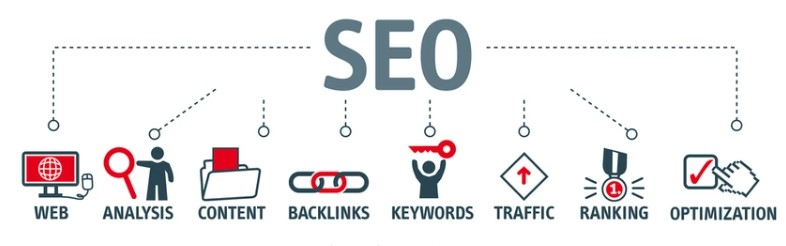

# Week 1 - Assignment

## What is a protocol stack, and how is it used in web development?

A protocol stack is a structured set of networking protocols and technologies that work collaboratively to facilitate communication between devices over a network. It's organized into layers, each with specific responsibilities, allowing for efficient data transmission, reception, and other networking tasks.

In the context of web development, a protocol stack refers to the combination of technologies and standards used to create and manage web applications. It consists of different layers, each serving a specific purpose:

Presentation Layer: This layer manages how data is presented to users. It includes technologies like HTML (Hypertext Markup Language) for structuring content, CSS (Cascading Style Sheets) for styling, and JavaScript for adding interactivity.

Application Layer: The application layer deals with business logic and user interactions. It utilizes programming languages (such as Python, Ruby, Java, or JavaScript) and frameworks (like Django, Ruby on Rails, or Express.js) to handle user requests, process data, and manage application flow.

Data Link Layer: Responsible for framing data into packets, error detection, and addressing.

Transport Layer: Ensures reliable data transfer between devices, handling segmentation, flow control, and error correction.

Database Layer: This layer involves database management systems (such as MySQL, PostgreSQL, or MongoDB) to store, retrieve, and manage the application's data.

Server Layer: The server layer is responsible for handling incoming requests from clients (web browsers) and sending back appropriate responses. It employs web servers (like Apache or Nginx) to manage and route requests to the appropriate parts of the application.

Networking Layer: This layer manages the communication between the client and the server using protocols like HTTP (Hypertext Transfer Protocol) and HTTPS (HTTP Secure). These protocols ensure that data is transmitted securely and efficiently over the internet.

When developing a web application, each layer of the protocol stack plays a crucial role in enabling the application's functionality and delivering a seamless user experience. Web developers choose specific technologies and tools for each layer based on project requirements, performance considerations, and their expertise.

In essence, a protocol stack in web development provides a structured framework that allows developers to create interactive, dynamic, and data-driven applications that can be accessed by users across the internet.

## What are the different types of web servers, and how do they differ in terms of functionality and performance?

In computing, a server is a piece of computer hardware or software (computer program) that provides functionality for other programs or devices, called "clients". This architecture is called the client–server model.

A web server is software and hardware that uses HTTP (Hypertext Transfer Protocol) and other protocols to respond to client requests made over the World Wide Web. The main job of a web server is to display website content through storing, processing and delivering webpages to users.

The different type of servers and their functionality are as follows:

### Proxy Server
A proxy server sits between a client program (typically a Web browser) and an external server (typically another server on the Web) to filter requests, improve performance, and share connections.

### Mail Server
Almost as ubiquitous and crucial as Web servers, mail servers move and store mail over corporate networks (via LANs and WANs) and across the Internet.

### Server Platforms
A term often used synonymously with operating system, a platform is the underlying hardware or software for a system and is thus the engine that drives the server.

### Web Server
At its core, a Web server serves static content to a Web browser by loading a file from a disk and serving it across the network to a user’s Web browser. This entire exchange is mediated by the browser and server talking to each other using HTTP.

### Application Server
Sometimes referred to as a type of middleware, application servers occupy a large chunk of computing territory between database servers and the end user, and they often connect the two.

### Real-Time Communication Server
Real-time communication servers, formerly known as chat servers or IRC Servers, and still sometimes referred to as instant messaging (IM) servers, enable large numbers users to exchange information near instantaneously.

### FTP Server
One of the oldest of the Internet services, File Transfer Protocol makes it possible to move one or more files securely between computers while providing file security and organization as well as transfer control.

### Collaboration Server
In many ways, collaboration software, once called ‘groupware,’ demonstrates the original power of the Web. Collaboration software designed to enable users to collaborate, regardless of location, via the Internet or a corporate intranet and to work together in a virtual atmosphere.

### List Server
List servers offer a way to better manage mailing lists, whether they be interactive discussions open to the public or one-way lists that deliver announcements, newsletters or advertising.

### Telnet Server
A Telnet server enables users to log on to a host computer and perform tasks as if they’re working on the remote computer itself.

### Open Source Server
From your underlying open source server operating system to the server software that help you get your job done, open source software is a critical part of many IT infrastructures.

### Virtual Server
In 2009, the number of virtual servers deployed exceeded the number of physical servers. Today, server virtualization has become near ubiquitous in the data center.

## What is web hosting, and what are the different types of hosting services available for websites?
A web hosting service is a type of Internet hosting service that hosts websites for clients, i.e. it offers the facilities required for them to create and maintain a site and makes it accessible on the World Wide Web. Companies providing web hosting services are sometimes called web hosts. Web hosting companies offer various types of hosting services to accommodate different website needs and ensure smooth online presence.

Different types of web hosting services and their features are as follows:

### Shared Hosting:
- Multiple websites share the same server and its resources.
- Cost-effective and easy to set up.
- Suitable for small websites and beginners.
- Limited resources and potential performance impact due to sharing.

### Virtual Private Server (VPS) Hosting:
- A physical server is divided into virtual servers with dedicated resources.
- Offers more control and customization than shared hosting.
- Better performance and reliability compared to shared hosting.
- Requires some technical knowledge for setup and management.

### Dedicated Hosting:
- An entire physical server is dedicated to a single website.
- Maximum control, performance, and customization options.
- Ideal for high-traffic websites and complex applications.
- Higher cost and advanced technical skills required.

### Cloud Hosting:
- Websites are hosted on a network of interconnected virtual and physical servers.
- Scalable, allowing resource adjustment based on demand.
- High availability and pay-as-you-go pricing.
- Can be more complex to set up and manage.

### Managed WordPress Hosting:
- Specifically designed for WordPress websites.
- Hosting provider manages server maintenance, updates, and security.
- Optimized for WordPress performance.
- Limited to WordPress sites and can be more expensive.

### Reseller Hosting:
- Allows individuals to sell hosting services to others.
- Purchase hosting resources from a provider and resell to clients.
- Opportunity to start a hosting business and generate revenue.
- Requires management and customer support skills.

### Colocation Hosting:
- You own and manage the physical server, hosted in a data center facility.
- Full control over hardware and infrastructure.
- Suitable for large organizations with specific needs.
- High upfront costs and technical expertise required.

Choosing the right hosting type depends on factors such as website size, traffic, technical requirements, budget, and expertise. Each type offers a unique balance of features, control, and performance to meet different website needs.

## What is scaling, and why is it important for web applications? How does scaling differ for vertical and horizontal scaling?

Scaling refers to the process of adjusting the capacity and resources of a system to handle increased demands, workload, or traffic. In the context of web applications, scaling ensures that the application can accommodate growing numbers of users, deliver consistent performance, and maintain responsiveness even during high usage periods. Scalability is a crucial consideration for modern web applications to ensure they can meet user expectations and business needs.

### Importance of Scaling for Web Applications:

#### Handle Increased Traffic:

As a web application gains popularity, the number of users accessing it simultaneously can increase significantly. Scaling ensures that the application remains accessible and responsive to a larger user base.

#### Maintain Performance:

caling helps prevent performance degradation, slowdowns, or downtime during periods of high demand. It ensures that users experience fast load times and smooth interactions.

#### Enhance User Experience:

sers expect seamless interactions and quick responses from web applications. Effective scaling ensures a positive user experience even as traffic surges.

#### Accommodate Growth:

As a business or service expands, the web application must accommodate the growing customer base and increased usage patterns.

#### Business Continuity:

Scaling supports business continuity by reducing the risk of outages or service disruptions that could impact revenue, reputation, and customer trust.

### Vertical Scaling vs. Horizontal Scaling:

#### Vertical Scaling:

Vertical scaling, also known as "scaling up," involves adding more resources (CPU, memory, storage) to an existing server. This typically means upgrading hardware components, such as increasing RAM or adding more powerful CPUs.

##### Advantages:

Simplified management, suitable for applications with single-threaded tasks or limited scalability requirements, often requires less modification to the application code.

##### Disadvantages:

Limited by the maximum capacity of the hardware, can be more expensive in the long run, potential for single points of failure.
Horizontal Scaling:

Horizontal scaling, also known as "scaling out," involves adding more servers to distribute the load. This can be achieved by deploying multiple instances of the application across different servers or virtual machines.
Advantages: Can handle larger traffic spikes and accommodate significant growth, cost-effective as resources can be added incrementally, improved fault tolerance.
Disadvantages: Requires more complex infrastructure setup, may involve adjustments to the application architecture, data synchronization challenges.

#### Comparison:

Vertical scaling improves the performance of a single server, while horizontal scaling increases the overall capacity of the system by distributing the load across multiple servers. Vertical scaling is suitable for applications that need to handle limited scaling needs and can benefit from improved single-threaded performance.

Horizontal scaling is ideal for applications that anticipate rapid growth, unpredictable traffic patterns, or the need for high availability and fault tolerance.
In conclusion, scaling is vital for web applications to ensure they can accommodate increased traffic, maintain performance, and provide a positive user experience.

The choice between vertical and horizontal scaling depends on the application's specific requirements, growth projections, and architectural considerations.

## What is SEO (Search Engine Optimization), and how can web developers optimize their websites for better search engine rankings?

SEO involves improving a website's visibility on search engines to attract more organic traffic. It aims to make the site rank higher in search results for relevant keywords.

Some of the ways used to achieve higher site ranking are as follows.

- Keywords: Research and use relevant keywords naturally in titles, content, and metadata.
- Quality Content: Create valuable and original content that addresses user needs.
- Titles and Descriptions: Craft unique page titles and meta descriptions with keywords.
- Mobile-Friendly: Ensure your site works well on mobile devices.
- Page Speed: Optimize page load times for better user experience.
- Links: Include internal and authoritative external links.
- Image Optimization: Use descriptive file names and alt text for images.
- Structured Data: Implement schema.org markup for content clarity.
- XML Sitemap: Create a sitemap to help search engines index your site.
- Secure Website: Use HTTPS for data security and ranking benefits.
- Social Media: Share content on social platforms for wider reach.
- Monitor and Analyze: Use tools to track website performance.
- User Experience: Prioritize intuitive navigation and clear layout.
- Ethical Practices: Avoid unethical tactics like keyword stuffing.

Implementing these practices improves website visibility, organic traffic, and search engine rankings.

### References:

1. [Wikipedia - Protocol Stack](https://en.wikipedia.org/wiki/Protocol_stack)
2. [Pinterest](https://in.pinterest.com/search/pins/?q=types%20of%20server%20infographic&rs=typed)
3. [Pexels](https://www.pexels.com/)
4. [Relavant software](https://relevant.software/blog/guide-large-scale-web-application-development/)
5. [Acropolium](https://acropolium.com/blog/how-to-scale-web-app/)
6. [Namecheap](https://www.namecheap.com/hosting/what-is-web-hosting-definition/)
7. [GeeksforGeeks](https://www.geeksforgeeks.org/web-server-and-its-type/)
8. [MilesWeb](https://www.milesweb.in/blog/hosting/web-server-types-web-servers/)

